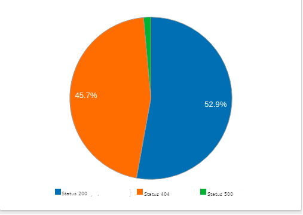

# Desafio de Front End

## Utilizando ReactJS

Baixe este projeto através do GIT.

Crie o componente Grafico (src/js/components/Grafico.js) através do framework ReactJS, com as seguintes caracteristicas:
- Possue a propriedade *data*, que recebe um array de objetos com as seguintes informações:
```javascript
[
{
    label: <titulo>,
    percentage: <valor da porcentagem>,
}
]
```
Exemplo:
```javascript
[
{
    label: "Status 200",
    percentage: 52.9,
},
{
    label: "Status 404",
    percentage: 45.7,
},
{
    label: "Status 500",
    percentage: 1.4,
}

]
```
- Após a atribuição da propriedade *data*, o componente renderizará um gráfico com um visual parecido ao demonstrado abaixo:


<br/><br/>
Crie o componente Resultado (src/js/components/Resultado.js) através do framework ReactJS, com as seguintes caracteristicas:
- Possue a propriedade *data*, que recebe um objeto com as seguintes informações:
```javascript
{
    labels: [<cabeçalho da tabela 1>,<cabeçalho da tabela 2>,<cabeçalho da tabela 3>],
    values: [[<valor 1>,<valor 2>,<valor 3>],
             [<valor 1>,<valor 2>,<valor 3>]]
}
```
Exemplo:
```javascript
{
    labels: ['Método', 'Endpoint', 'Status', 'Quantidade'],
    values: [['POST','/user','200', 19],
             ['POST','/user','404', 1]]
}
```
- Após a atribuição da propriedade *data*, o componente renderizará uma tabela com um visual parecido ao demonstrado abaixo:

|Método|Endpoint|Status|Quantidade|
|------|--------|------|----------|
|POST|/user|200|19|
|POST|/user|404|1|


Para obter as informações exibidas pelos componentes, é necessário acessar estes através da variável global *callsData* (/src/js/data/calls.js).

Estilize a página (crie seu layout) a vontade (src/index.html).

Converta a data/hora obtida para a data/hora Brasil (horário de Brasília).

Filtre os dados da variável *callsData* para cada dia selecionado (tag select), se não existir informações neste dia, não exiba o gráfico e exiba a tabela vazia (o filtro deve considerar a data/hora de Brasília).

Crie um repositório seu no bitbucket ou github com a resolução do problema e passe para o RH.

Se possível, crie/altere o README.md e descreva sobre a resolução, e o que poderia ser melhorado no código (no seu e no que foi disponibilizado).
